# Personal Projects

- [Full-Stack Highlights](#full-stack-highlights)
- [Backend Highlights](#backend-highlights)
- [Frontend Highlights](#frontend-highlights)
- [Typescript](#typescript)
- [Go](#go)
- [Python](#python)
- [C#](#c)
- [Kotlin](#kotlin)
- [Java](#java)
- [JavaScript](#javascript)
- [React Native](#react-native)

## Full-Stack Highlights

<details>
<summary>OAuth 2.0 Flow</summary>

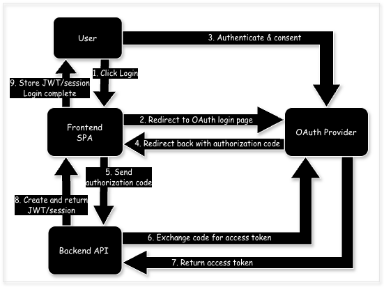

- State: Stateless
- Token Type: Access Token (JWT/Opaque/session ID)

</details>

<details>
<summary>Password Cookie Session Flow</summary>

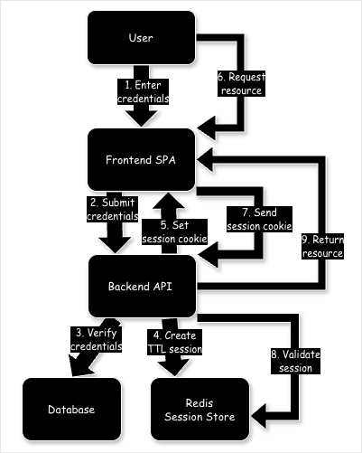

- State: Stateful
- Token Type: Session ID

</details>

<details>
<summary>JWT Token Flow</summary>

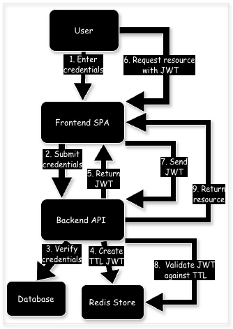

- State: Stateless
- Token Type: JWT

</details>

<details>
<summary>AI Productization Flow</summary>

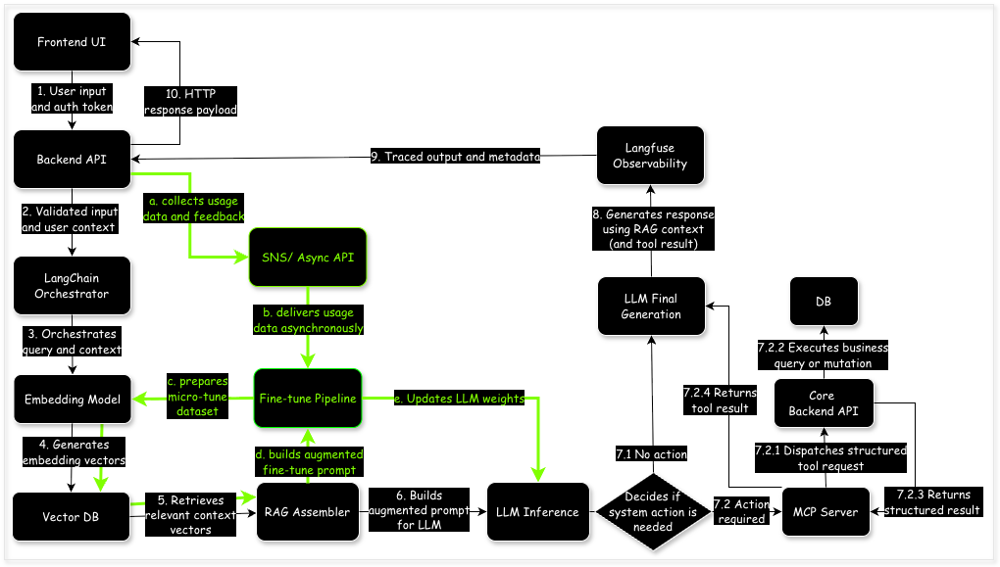

</details>

<details>
<summary>AI Evolution Architecture Stages</summary>

1.  <details>
    <summary>Traditional Chatbot - Rule-Based Approach</summary>

    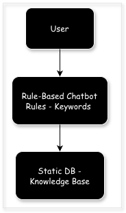
    </details>

2.  <details>
    <summary>LLM Response - No Action Capability</summary>

    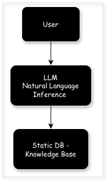
    </details>

3.  <details>
    <summary>AI Agent - Pre-MCP Decision Making</summary>

    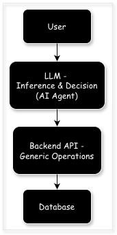
    </details>

4.  <details>
    <summary>Build Solid Backend Foundations - Core Capability Layer</summary>

    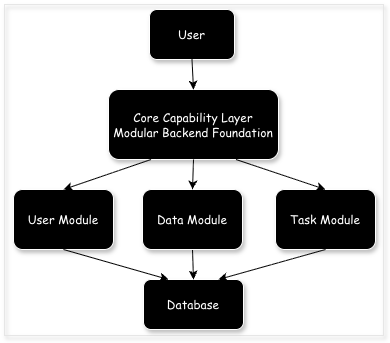
    </details>

5.  <details>
    <summary>Introduce MCP Server - Tool Integration Layer</summary>
    </details>

6.  <details>
    <summary>Intent Classification & Selective MCP Usage</summary>
    </details>

7.  <details>
    <summary>Model Evolution - Deploying Local LLM</summary>
    </details>

</details>

## Backend Highlights

<details>
<summary>Serverless Lambda API Architecture</summary>

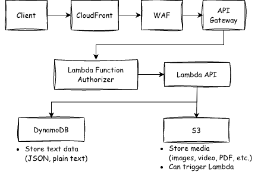

</details>

<details>
<summary>ECS & EKS API with Redis Cache Architecture</summary>

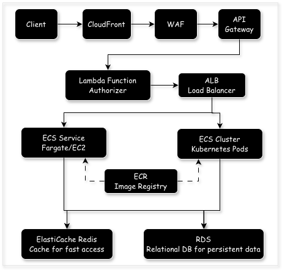

</details>

<details>
<summary>EDA with Saga and CRDT OR-Set on SQS</summary>

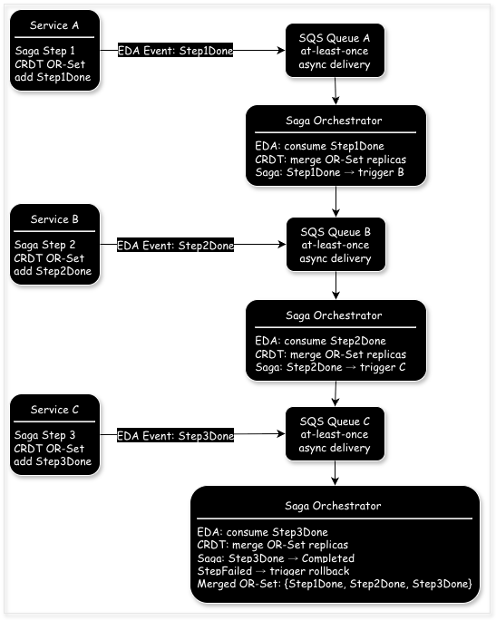

- **Event-Driven Architecture (EDA)**: Services emit StepDone events asynchronously and the Saga Orchestrator subscribes
- **Simple Queue Service (SQS) Queues**: Ensure at-least-once delivery and decouple services
- **Saga Pattern**: Orchestrator enforces step order, triggers next step, and handles compensation
- **Conflict-Free Replicated Data Types (CRDT) Replicas**: Services keep local OR-Set replicas and the orchestrator merges them
- **Observed-Remove Set (OR-Set)**: Tracks StepDone or StepFailed events and avoids duplicates
- **Single Saga Orchestrator**: Central component that evaluates merged OR-Set and drives the workflow
- **Asynchronous Flow**: Events flow through SQS to the orchestrator and then to the next service

</details>

## Frontend Highlights

### Page Layouts

<details>
<summary>Homepage</summary>

- Component: Header, Hero, Card, Footer
- Features: LTR, English, Light Theme
  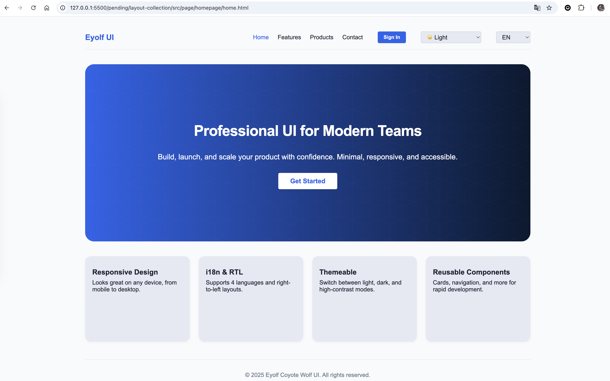

</details>

<details>
<summary>Homepage RTL i18n</summary>

- Component: Header, Hero, Card, Footer
- Features: RTL, Arabic, Light Theme
  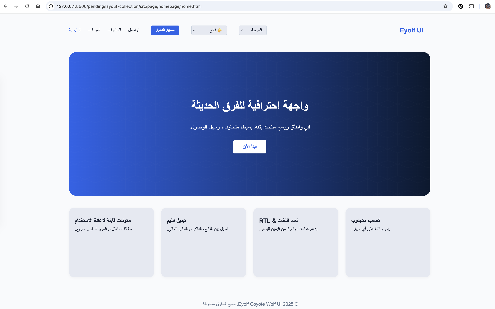

</details>

<details>
<summary>Signup Page</summary>

- Component: Header, Toolbar, Card, Footer
- Features: LTR, Chinese, Dark Theme
  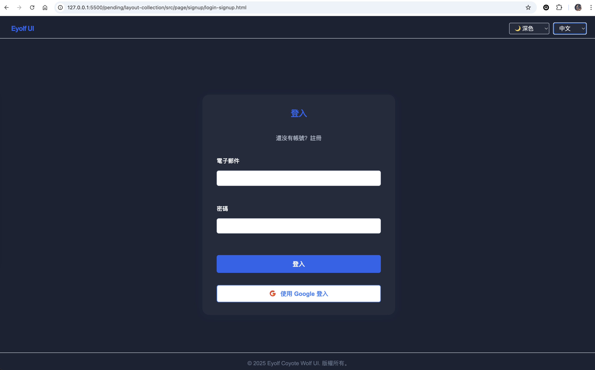

</details>

<details>
<summary>Product Listing Page</summary>

- Component: Header, Toolbar, Sidebar, Product card, Pagination, Footer
- Features: LTR, Japanese, High Contrast Theme
  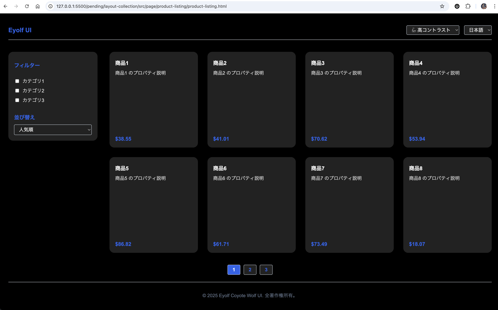

</details>

<details>
<summary>3D Product Showcase Page</summary>

- Component: Header, Description, ThreeCanvas, Footer
- Features: three.js 3D interactive scene
  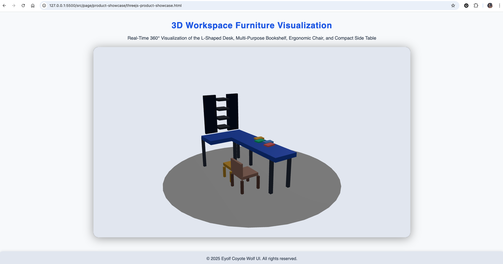

</details>

### Design System

#### Component

- <details>
  <summary>Button</summary>

  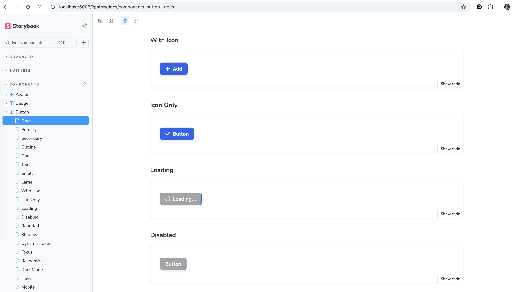

  </details>

- <details>
  <summary>Alert</summary>

  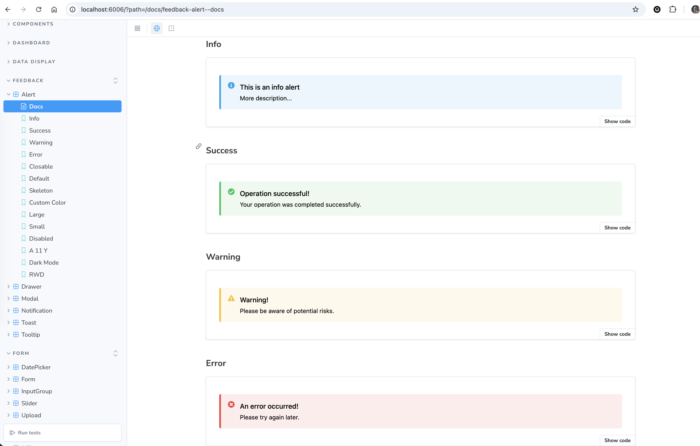

  </details>

- <details>
  <summary>Breadcrumb</summary>

  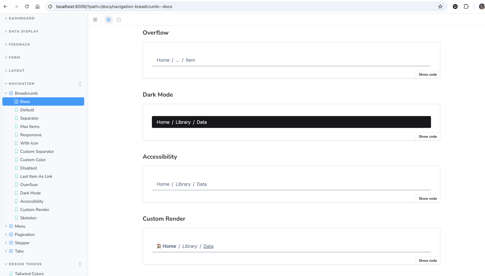

  </details>

#### Token

- <details>
  <summary>Color Design Token</summary>

  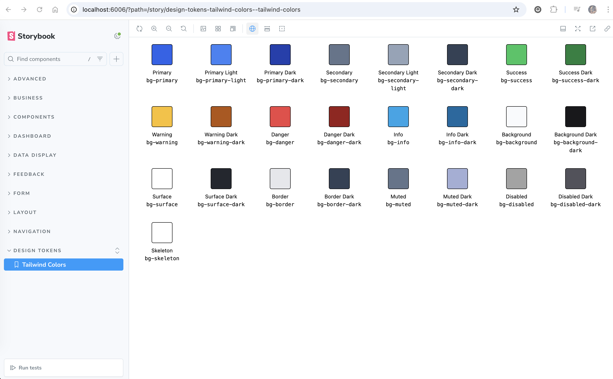

  </details>

### Data Flow

- <details>
  <summary>Frontend Data Flow</summary>

  ```mermaid
  %%{init: {"theme":"neutral"}}%%
  flowchart TD
    subgraph SSR[SSR]
      A[1 Browser → Server: Page Request]
      A --> B[2 Server: Call API to get data]
      B --> C[3 Server: Render HTML]
    end

    subgraph CSR[CSR]
      C --> D[4 Browser: Attach JS, enable interactivity]
      D --> E1[5 Browser: Render component in DOM]
    end

    subgraph DataFetch[Data Fetch]
      D --> F[6 Browser: Fetch Data via axios/fetch/React Query/SWR]
      F --> G[7 Browser: Store fetched data in Cache]
    end

    subgraph State[State Management]
      G --> H[8 Browser: Update Zustand/Redux Store]
      H --> E2[9 Browser: UI re-render - component in DOM]
    end
  ```

  </details>

---

## Typescript

- [React.js Tailwind CSS Design System](src/typescript/react-tailwind_design-system/)
- [React.js Tailwind CSS Web App](src/typescript/web-app/)
- [Vue.js Tailwind CSS Design System](src/typescript/vue-tailwind_design-system/)
- [Vue.js Tailwind CSS Dashboard App](src/typescript/dashboard-web-app/)
- [Nest.js User Service](src/typescript/user-service/)
- [Nest.js Vector Memory Service](src/typescript/vector-memory-service/)
- [Nest.js AI Agent Service](src/typescript/ai-agent-service/)
- [Nest.js AI Orchestrator Service](src/typescript/ai-orchestrator-service/)
- [Nest.js LLM Adapter Service](src/typescript/llm-adapter-service/)

## Go

- [Gin User Service](src/go/user-service/)
- [gRPC Sync Service](src/go/sync-service/)
- [gRPC Broker Service](src/go/broker-service/)
- [gRPC Config Service](src/go/config-service/)
- [gRPC Real-time Service](src/go/realtime-service/)

## Python

- [FastAPI Edge LLM Inference](src/python/fastapi_edge-llm-infer/)

## C#

- [C# .NET User Service](src/csharp/csharp-dotnet_user-service/)

## Kotlin

- [Kotlin Spring Boot User Service](src/kotlin/kotlin-spring-boot_user-service/)

## Java

- [Java Spring Boot User Service](src/java/java-spring-boot_user-service/)

## JavaScript

- [Express.js User Service](src/javascript/node-express_user-service/)

## React Native

- [React Native Mobile App](src/reactnative/mobile-app)
- [React Native Mobile Design System](src/reactnative/react-native_design-system/)
