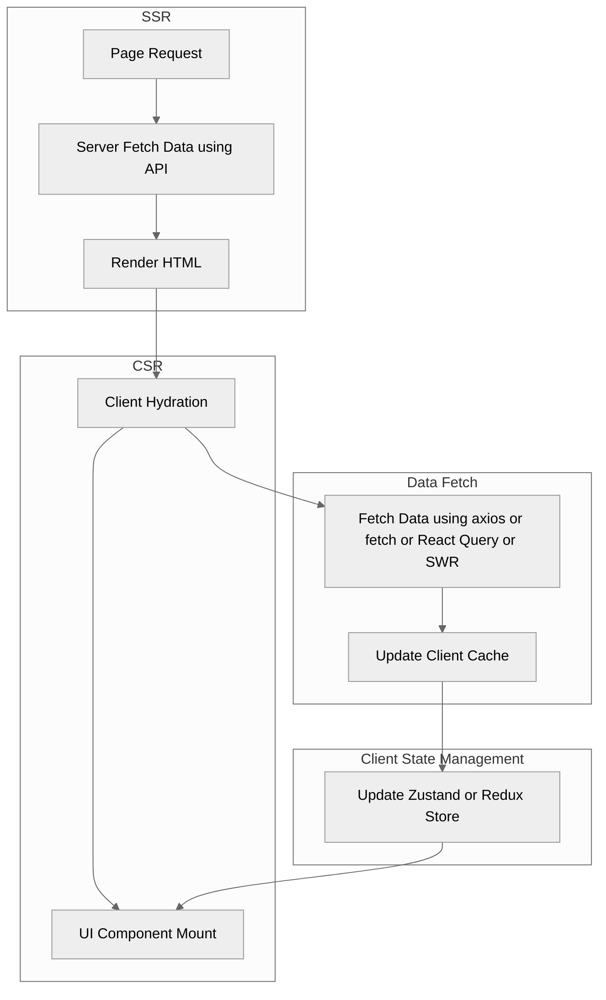

# Code Portfolio

## Full-Stack Highlights

### OAuth 2.0 Flow

- State: Stateless
- Token Type: Access Token (JWT/Opaque/session ID)

### Password Cookie Session Flow

- State: Stateful
- Token Type: Session ID

### JWT Token Flow

- State: Stateless
- Token Type: JWT

### AI Productization Flow

## Backend Highlights

### Serverless Lambda API Architecture

### ECS & EKS API with Redis Cache Architecture

### EDA with Saga and CRDT on SQS

## Frontend Highlights

### Page Layouts

#### Homepage

- Layout: pattern
- Component:

#### Homepage RTL i18n

#### Login / Signup Page

- Layout: pattern
- Component:

#### Product Listing Page

- Layout: pattern
- Component:

### Design System

#### Component

#### Token

### Data Flow

---

## Typescript

## Go

## Python

- [FastAPI Edge LLM Inference](src/python/fastapi_edge-llm-infer/)

## C#

- [C# .NET User Service](src/csharp/csharp-dotnet_user-service/)

## Kotlin

- [Kotlin Spring Boot User Service](src/kotlin/kotlin-spring-boot_user-service/)

## Java

- [Java Spring Boot User Service](src/java/java-spring-boot_user-service/)

## JavaScript

- [Express.js User Service](src/javascript/node-express_user-service/)
