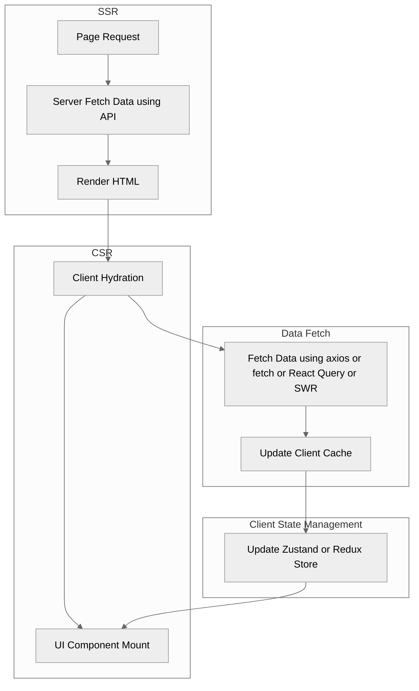

# Code Portfolio

## Full-Stack Highlights

### OAuth 2.0 Flow

- State: Stateless
- Token Type: Access Token (JWT/Opaque/session ID)

### Password Cookie Session Flow

- State: Stateful
- Token Type: Session ID

### JWT Token Flow

- State: Stateless
- Token Type: JWT

### AI Productization Flow

## Backend Highlights

### Serverless Lambda API Architecture

### ECS & EKS API with Redis Cache Architecture

### EDA with Saga and CRDT on SQS

## Frontend Highlights

### Page Layouts

#### Homepage

- Component: Header, Hero, Card, Footer
- Features: LTR, English, Light Theme
  

#### Homepage RTL i18n

- Component: Header, Hero, Card, Footer
- Features: RTL, Arabic, Light Theme
  

#### Signup Page

- Component: Header, Toolbar, Card, Footer
- Features: LTR, Chinese, Dark Theme
  

#### Product Listing Page

- Component: Header, Toolbar, Sidebar, Product card, Pagination, Footer
- Features: LTR, Japanese, High Contrast Theme
  

### Design System

#### Component

- Button
  

- Alert
  

- Breadcrumb
  

#### Token

### Data Flow

---

## Typescript

- [React.js Tailwind CSS Design System](src/typescript/react-tailwind_design-system/)

## Go

## Python

- [FastAPI Edge LLM Inference](src/python/fastapi_edge-llm-infer/)

## C#

- [C# .NET User Service](src/csharp/csharp-dotnet_user-service/)

## Kotlin

- [Kotlin Spring Boot User Service](src/kotlin/kotlin-spring-boot_user-service/)

## Java

- [Java Spring Boot User Service](src/java/java-spring-boot_user-service/)

## JavaScript

- [Express.js User Service](src/javascript/node-express_user-service/)
