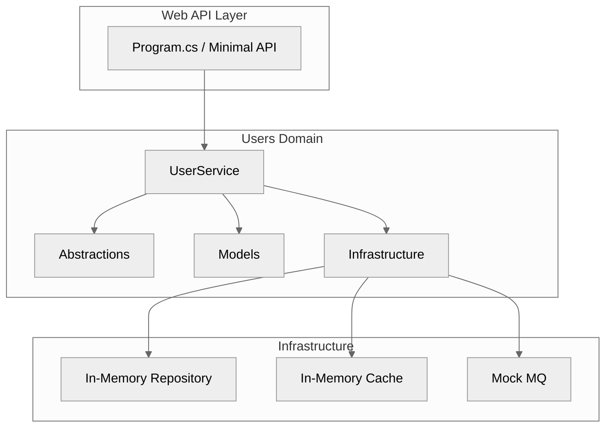
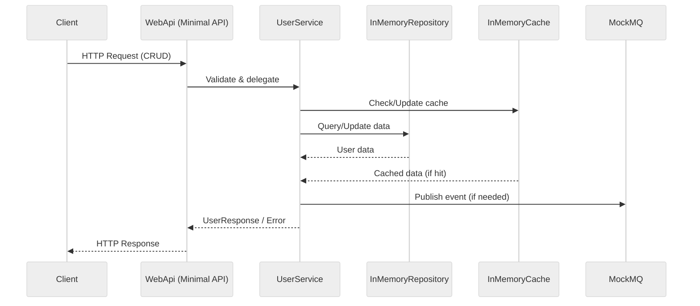

# C# .NET Web API

Robust .NET 9 Web API for versioned user CRUD, in-memory adapters, Swagger, and comprehensive test coverage.

## 🗂️ Architecture Diagram



---

## 🔄 Data Flow Sequence Diagram



---

## ✨ Tech Stack Highlight

- **Language:** C# 12
- **Framework:** .NET 9 (ASP.NET Core Minimal API)
- **Project Structure:** Solution with Web API and xUnit test project
- **API Docs:** Swagger (enabled in Development)
- **Testing:** xUnit, Coverlet (code coverage)
- **Build Tool:** dotnet CLI, Makefile
- **Config:** appsettings.json, appsettings.Development.json
- **Extensible:** In-memory repository, cache, mock MQ (Users domain)
- **CI/CD Ready:** Coverage, HTML report, clean targets

---

## 🚀 Usage

### Restore dependencies

```bash
dotnet restore
# or
make restore
```

### Build the solution

```bash
dotnet build
# or
make build
```

### Run the Web API (default port)

```bash
dotnet run --project src/WebApi/WebApi.csproj
# or
make run
```

### Run the Web API on a custom port

```bash
ASPNETCORE_URLS=http://localhost:5000 dotnet run --project src/WebApi/WebApi.csproj
# or
make run-port PORT=5000
```

### Run all tests

```bash
dotnet test
# or
make test
```

### Run tests with coverage

```bash
make coverage
```

### Generate HTML coverage report

```bash
make coverage-report
# (then open coverage/report/index.html)
```

### Clean build artifacts

```bash
dotnet clean
# or
make clean
```

### Open Swagger UI (Development only)

```bash
http://localhost:5088/swagger
```
