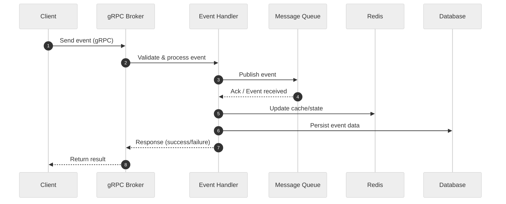

# Broker Service

An event-driven gRPC broker service for real-time message routing and integration between distributed systems, written in Go.

## 🗂️ Architecture Diagram (Mermaid)

```mermaid
%%{init: {"theme":"neutral"}}%%
flowchart TD
  Client[Client]
  GRPCServer[gRPC Broker Service]
  EventHandler[Event Handler]
  MQ[Message Queue / PubSub]
  Redis[Redis (Cache/State)]
  DB[Database]

  Client -->|gRPC| GRPCServer
  GRPCServer --> EventHandler
  EventHandler --> MQ
  EventHandler --> Redis
  EventHandler --> DB
  MQ --> EventHandler
  Redis --> EventHandler
  DB --> EventHandler
```

---

## 🔄 Data Flow Sequence Diagram (Mermaid)



---

## ✨ Tech Stack Highlight

- **Language**: Go 1.24
- **Framework**: gRPC 1.76, Protobuf 1.36
- **Build Tool**: Make
- **Testing**: go test

---

## 🚀 Usage

- **Install dependencies:**

  ```sh
  go mod tidy
  ```

- **Generate gRPC code from proto:**

  ```sh
  make proto
  ```

- **Run the service:**

  ```sh
  make run
  # or
  go run ./cmd/main.go
  ```

- **Run all unit tests:**

  ```sh
  make test
  # or
  go test ./internal/... ./api/...
  ```

- **Run smoke test (Go client):**

  ```sh
  make smoke-go
  ```

- **Run all smoke tests (auto):**

  ```sh
  make smoke-auto
  ```

- **Check code coverage:**

  ```sh
  make coverage
  ```

- **Format code:**

  ```sh
  make format
  ```

- **Lint code:**

  ```sh
  make lint
  ```
