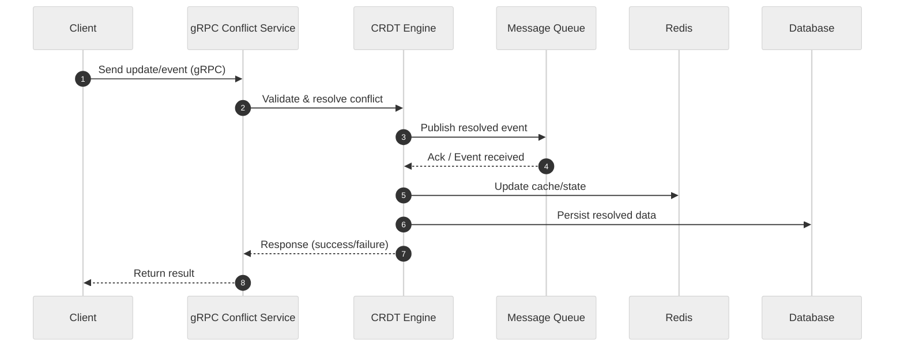

# Conflict Service

A gRPC-based conflict resolution service for distributed systems, providing CRDT logic, state sync, and real-time event handling in Go.

## 🗂️ Architecture Diagram (Mermaid)

```mermaid
%%{init: {"theme":"neutral"}}%%
flowchart TD
  Client[Client]
  GRPCServer[gRPC Conflict Service]
  CRDT[CRDT Engine]
  MQ[Message Queue / PubSub]
  Redis[Redis (Cache/State)]
  DB[Database]

  Client -->|gRPC| GRPCServer
  GRPCServer --> CRDT
  CRDT --> MQ
  CRDT --> Redis
  CRDT --> DB
  MQ --> CRDT
  Redis --> CR`DT
  DB --> CRDT
```

---

## 🔄 Data Flow Sequence Diagram (Mermaid)



---

## ✨ Tech Stack Highlight

- **Language**: Go 1.22
- **Framework**: gRPC 1.64, Protobuf 1.33
- **Build Tool**: Make
- **Testing**: go test

---

## 🚀 Usage

- **Install dependencies:**

  ```sh
  go mod tidy
  ```

- **Generate gRPC code from proto:**

  ```sh
  make proto
  ```

- **Run the service:**

  ```sh
  make run
  # or
  go run ./cmd/main.go
  ```

- **Run all unit tests:**

  ```sh
  make test
  # or
  go test ./...
  ```

- **Run smoke test (Go client):**

  ```sh
  make smoke-go
  ```

- **Run all smoke tests (auto):**

  ```sh
  make smoke-auto
  ```

- **Run grpcurl smoke test:**

  ```sh
  make smoke
  # or
  sh scripts/smoke_grpcurl.sh
  ```

- **Check code coverage:**

  ```sh
  make coverage
  ```

- **Format code:**

  ```sh
  make format
  ```

- **Lint code:**

  ```sh
  make lint
  ```
