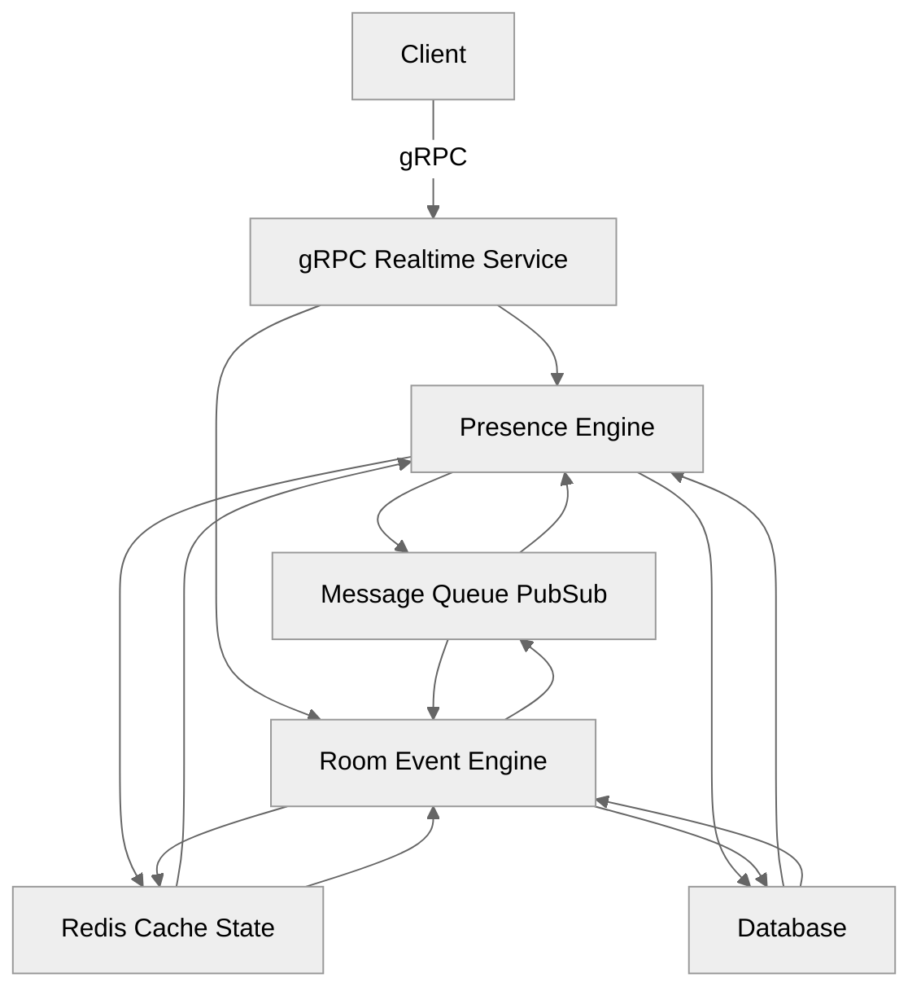
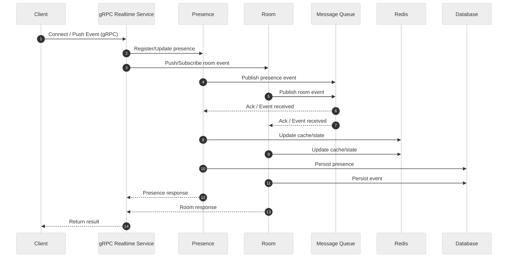

# Realtime Service

A real-time gRPC service for presence, room events, and push notifications, enabling collaborative features for distributed applications in Go.

## 🗂️ Architecture Diagram



---

## 🔄 Data Flow Sequence Diagram (Mermaid)



---

## ✨ Tech Stack Highlight

- **Language**: Go 1.x
- **Framework**: gRPC, Protobuf
- **Build Tool**: Make
- **Testing**: go test

---

## 🚀 Usage

- **Install dependencies:**

```sh
go mod tidy
```

- **Generate gRPC code from proto:**

```sh
make proto
```

- **Run the service:**

```sh
make run
# or
go run ./cmd/main.go
```

- **Run all unit tests:**

```sh
make test
# or
go test ./...
```

- **Run smoke test:**

```sh
make smoke
# or
go run ./test/smoke_client.go
```

- **Format code:**

```sh
make format
```

- **Lint code:**

```sh
make lint
```
