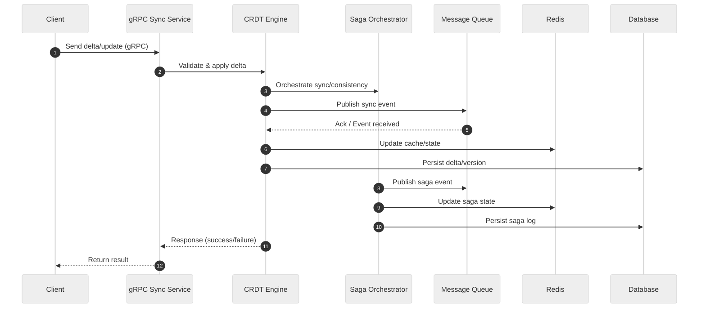

# Sync Service

A gRPC-based document sync service for distributed systems, supporting delta sync, versioning, and replay with CRDT logic in Go.

## 🗂️ Architecture Diagram

```mermaid
%%{init: {"theme":"neutral"}}%%
flowchart TD
 Client[Client]
 GRPCServer[gRPC Sync Service]
 CRDT[CRDT Engine]
 Saga[Saga Orchestrator]
 MQ[Message Queue / PubSub]
 Redis[Redis (Cache/State)]
 DB[Database]

 Client -->|gRPC| GRPCServer
 GRPCServer --> CRDT
 CRDT --> Saga
 CRDT --> MQ
 CRDT --> Redis
 CRDT --> DB
 Saga --> MQ
 Saga --> Redis
 Saga --> DB
 MQ --> CRDT
 Redis --> CRDT
 DB --> CRDT
```

---

## 🔄 Data Flow Sequence Diagram



---

## ✨ Tech Stack Highlight

- **Language**: Go 1.20
- **Framework**: gRPC 1.64, Protobuf 1.33
- **Build Tool**: Make
- **Testing**: go test

---

## 🚀 Usage

- **Install dependencies:**

  ```sh
  go mod tidy
  ```

- **Run the service:**

  ```sh
  make run
  # or
  go run ./cmd/main.go
  ```

- **Run all unit tests:**

  ```sh
  make test
  # or
  go test ./...
  ```

- **Run smoke test:**

  ```sh
  make smoke
  # or
  go run ./test/smoke_client.go
  ```

- **Format code:**

  ```sh
  make format
  ```

- **Lint code:**

  ```sh
  make lint
  ```
