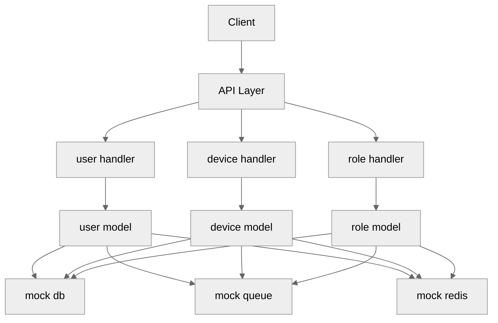
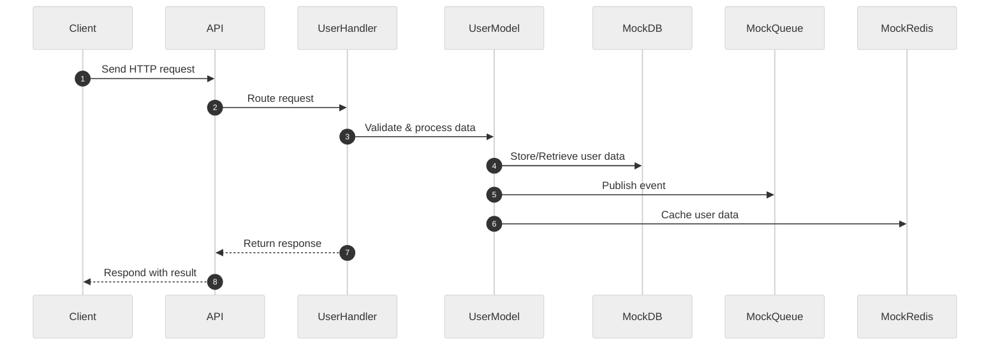

# User Service

A Go microservice for user, device, and role management with mock integrations.

## 🗂️ Architecture Diagram



## 🔄 Data Flow Sequence Diagram



## ✨ Technology Overview

- **Language:** Go 1.21
- **API Layer:** net/http
- **Project Structure:** Clean architecture (handler, model, mock)
- **Testing:** go test (unit tests)
- **Mocking:** Custom mock implementations (db, queue, redis)
- **Dependency Management:** Go Modules (go.mod)
- **Code Formatting:** go fmt
- **Linting:** golint

## 🚀 Usage

- **Install dependencies:**

  ```sh
  go mod tidy
  ```

- **Run the service:**

  ```sh
  go run ./cmd/main.go
  ```

- **Run all unit tests:**

  ```sh
  go test ./...
  ```

- **Run smoke test:**

  ```sh
  go run ./test/smoke_client.go
  ```

- **Format code:**

  ```sh
  go fmt ./...
  ```

- **Lint code:**

  ```sh
  golint ./...
  ```
