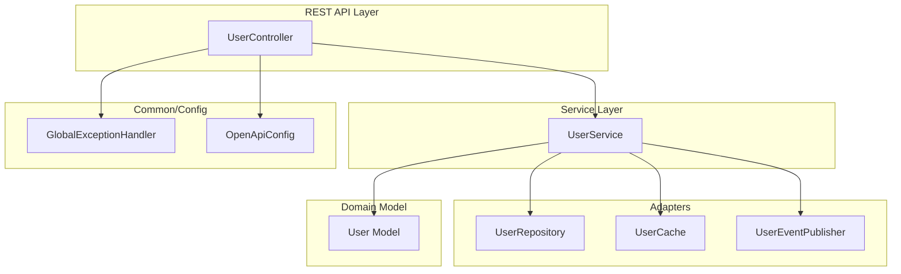
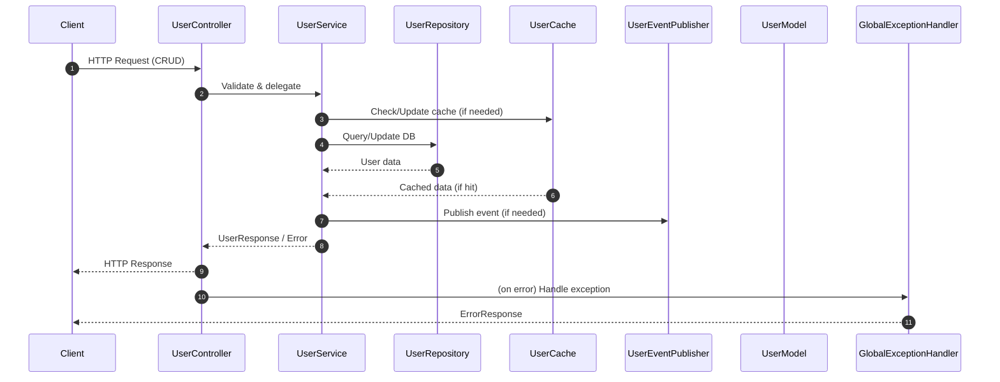

# User Management CRUD API (Versioned: v1)

Spring Boot 3 user management API featuring clean architecture, OpenAPI documentation, modular adapters, and comprehensive test coverage.

## 🗂️ Architecture Diagram



---

## 🔄 Data Flow Sequence Diagram



---

### 🛠️ Tech Stack Highlight

- **Language:** Java 21
- **Framework:** Spring Boot 3
- **Web:** spring-boot-starter-web, spring-boot-starter-validation
- **API Docs:** springdoc-openapi (Swagger UI)
- **Testing:** JUnit 5, Mockito, AssertJ
- **Code Quality:** Spotless (Google Java Style)
- **Coverage:** JaCoCo
- **Build Tool:** Maven
- **Profiles:** application.properties, application-dev.properties, application-test.properties
- **Extensible Adapters:** In-memory repository, cache, event publisher (extensible to JPA, Redis, MQ)
- **Dev Tools:** Makefile, pre-commit hook (Spotless)

---

## 🚀 Usage

### Build the project

```bash
./mvnw clean verify
```

### Run the application (default profile)

```bash
./mvnw spring-boot:run
```

### Run with development profile

```bash
./mvnw spring-boot:run -Dspring-boot.run.profiles=dev
```

### Run unit tests

```bash
./mvnw test
```

### Open Swagger UI

```bash
http://localhost:8080/swagger-ui/index.html
```

### Health check

```bash
curl -s http://localhost:8080/actuator/health | jq
```
