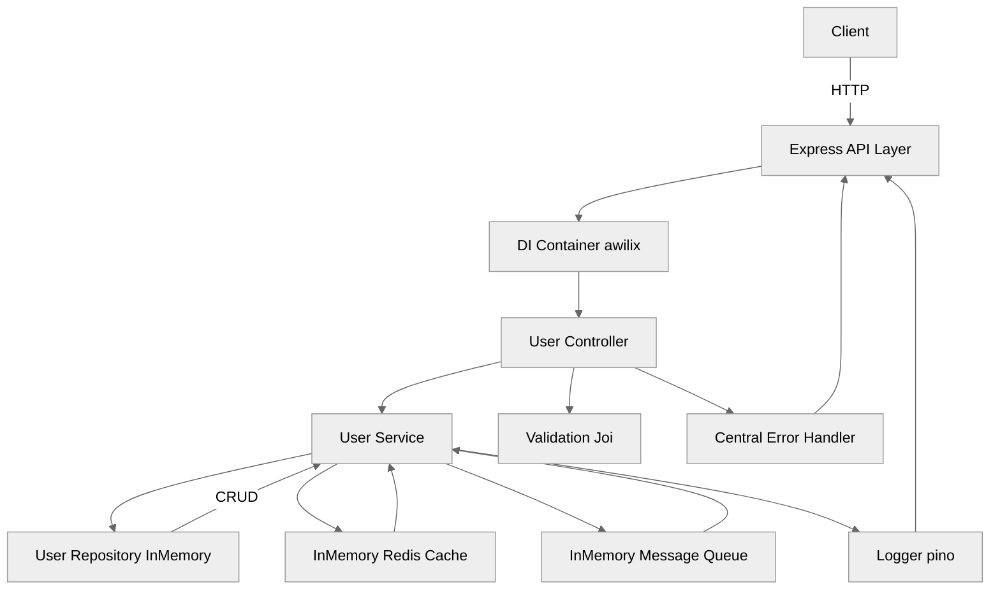
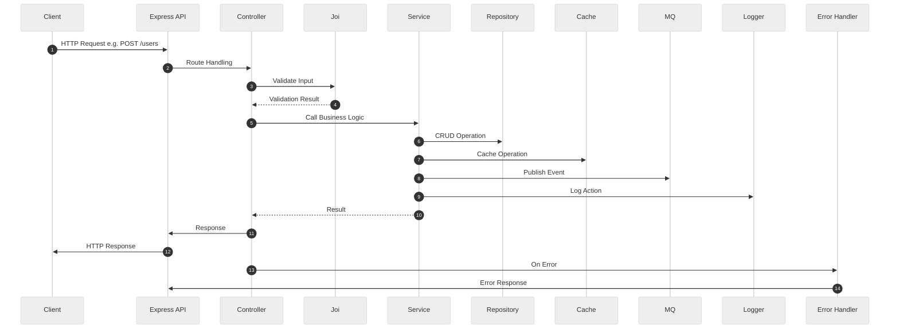

# Express.js User Service API

Modern Express.js user service API with clean architecture, DI, validation, logging, and extensible adapters.

## 🗂️ Architecture Diagram



## 🔄 Data Flow Sequence Diagram



---

## ✨ Tech Stack Highlight

- **Language:** JavaScript ES2022+, Node.js 20
- **Framework:** Express 4
- **Dependency Injection:** awilix
- **Validation:** Joi
- **Logging:** pino
- **Testing:** Jest, Supertest
- **Code Quality:** ESLint, Prettier
- **Coverage:** Jest Coverage
- **Dev Tools:** Nodemon, Makefile
- **Extensible Adapters:** In-memory repo, cache, MQ (extensible)

---

## 🚀 Usage

Install dependencies:

```bash
npm install
```

Development mode (auto-reload):

```bash
npm run dev
```

Start server (production):

```bash
npm start
```

Run tests:

```bash
npm test
```

Test coverage:

```bash
npm run test:coverage
```

Watch tests:

```bash
npm run test:watch
```

Lint:

```bash
npm run lint
```

Auto-fix lint:

```bash
npm run lint:fix
```

Format code:

```bash
npm run format
```
