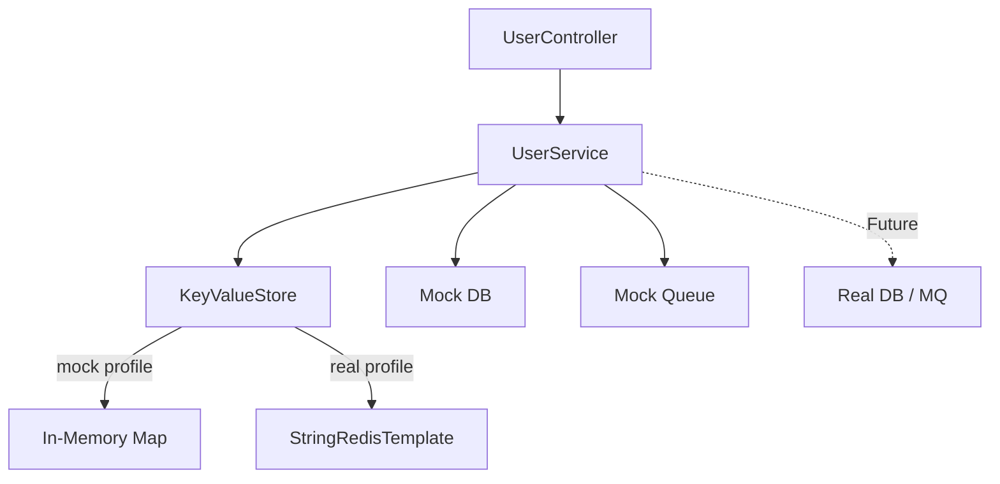
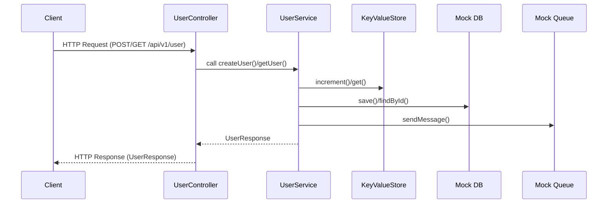

# kotlin-spring-boot_user-service

A modern Kotlin and Spring Boot 3.x backend service with mockable infrastructure, RESTful APIs, and robust developer tooling.

## 🗂️ Architecture Diagram



---

## 🔄 Data Flow Diagram



---

## 🛠️ Tech Stack Highlight

- **Language:** Kotlin (JVM, JDK 21)
- **Framework:** Spring Boot 3.x
- **Web:** Spring Web (REST API)
- **Persistence:** Spring Data JPA (PostgreSQL, H2 for dev/test)
- **Cache/Key-Value:** Spring Data Redis (with in-memory mock for local)
- **Messaging:** Spring AMQP (RabbitMQ, with mock queue for local)
- **API Docs:** springdoc-openapi (Swagger UI)
- **Monitoring:** Spring Boot Actuator
- **Testing:** JUnit 5, Mockito, Spring Boot Test, spring-rabbit-test
- **Static Analysis:** ktlint, detekt
- **Build Tool:** Gradle (Kotlin DSL)
- **Other:** Jacoco (test coverage), Devtools (hot reload)

---

## 🚀 Usage

### Gradle Commands

- Start local service:

  ```sh
  ./gradlew bootRun
  ```

- Start with mock profile (mock db/queue/in-memory store):

  ```sh
  ./gradlew bootRun --args='--spring.profiles.active=mock'
  ```

- Run all static analysis and tests:

  ```sh
  ./gradlew check
  ```

- Run only format checks (ktlint/detekt):

  ```sh
  ./gradlew ktlintMainSourceSetCheck
  ./gradlew detektMain
  ```

- Clean build cache:

  ```sh
  ./gradlew clean
  ```

### Makefile Shortcuts

- Show all targets:

  ```sh
  make help
  ```

- Build and test:

  ```sh
  make build
  ```

- Run with mock profile:

  ```sh
  make run-mock
  ```

- Run with custom profile:

  ```sh
  make run PROFILE=mock
  ```

- Run jar with mock profile:

  ```sh
  make run-jar-mock
  ```

- Run unit tests:

  ```sh
  make test
  ```

- Generate coverage report:

  ```sh
  make coverage
  ```

- Lint check:

  ```sh
  make lint
  ```

- Auto-format code:

  ```sh
  make format
  ```

- Run detekt static analysis:

  ```sh
  make detekt
  ```

- Verify (lint + detekt + test + coverage):

  ```sh
  make verify
  ```

- CI recommended sequence:

  ```sh
  make ci
  ```
