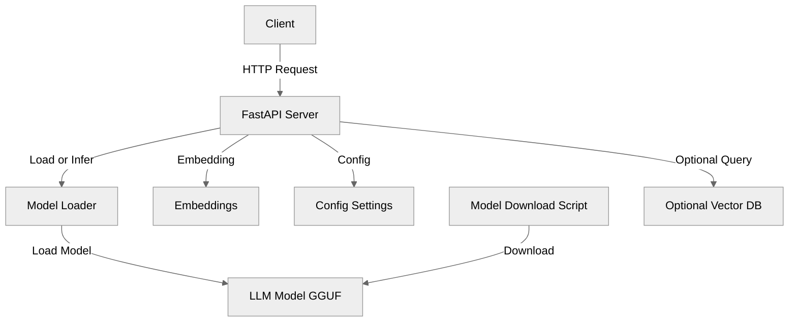
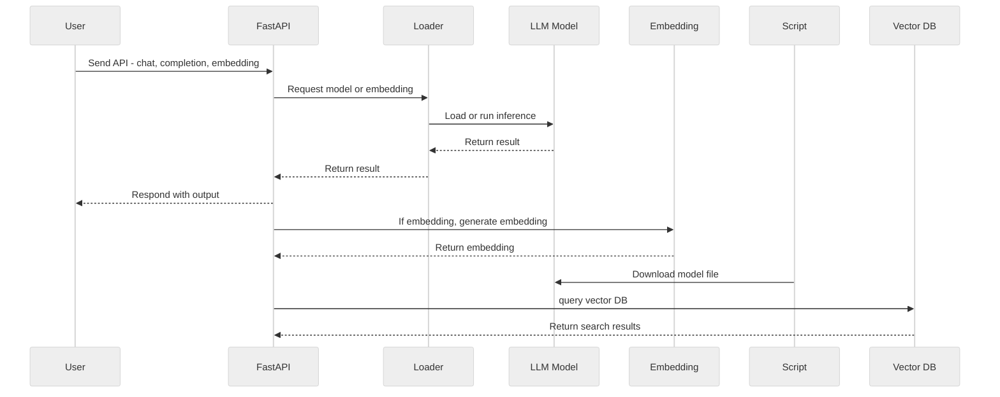

# Edge LLM Inference

A blazing-fast FastAPI LLM inference server with modern Python tooling, multilingual support, and seamless model management.

## 🗂️ Architecture Diagram



---

## 🔄 Data Flow Sequence Diagram



---

## ✨ Tech Stack Highlight

- **Language:** Python 3.11
- **Framework:** FastAPI 0.114.1
- **LLM Inference:** llama-cpp-python 0.2.90
- **Web:** FastAPI, sse-starlette (SSE streaming)
- **API Docs:** FastAPI built-in OpenAPI (Swagger UI)
- **Validation:** Pydantic 2.9.2
- **Dependency Management:** uv, pip
- **Automation:** Makefile
- **Logging:** loguru 0.7.2
- **Model Download:** HuggingFace Hub
- **Testing:** pytest
- **Code Quality:** pre-commit hook (black, isort, ruff)

---

## 🚀 Usage

### Quickstart

```sh
# One command: download tiny model, start server, run tests
make ensure
```

#### Setup Python Environment

- Python 3.11.x is required for full compatibility.

  ```sh
  # Install pyenv if not present
  brew install pyenv

  # Add these lines to ~/.zshrc (if not already present):
  export PYENV_ROOT="$HOME/.pyenv"
  export PATH="$PYENV_ROOT/bin:$PATH"
  eval "$(pyenv init --path)"
  eval "$(pyenv init -)"

  # Restart terminal or reload shell config
  source ~/.zshrc

  # Install and activate Python 3.11.8 in the project directory
  pyenv install 3.11.8
  pyenv local 3.11.8
  python --version  # Should print Python 3.11.x
  ```

  If a different Python version appears, ensure `pyenv` is initialized and shims are at the front of the `$PATH`.

  ```sh
  echo $PATH
  # ~/.pyenv/shims should appear before /usr/bin or /usr/local/bin
  ```

- Recommended: Use uv for fast, reliable dependency install

  ```sh
  curl -LsSf https://astral.sh/uv/install.sh | sh
  uv venv .venv
  source .venv/bin/activate
  uv sync
  ```

- Or, fallback to pip if uv is unavailable:

  ```sh
  python3 -m venv .venv
  source .venv/bin/activate
  pip install -r requirements.txt
  ```

#### Makefile Shortcuts

- Download TinyLlama and set MODEL_PATH:

  ```sh
  make tiny
  ```

- Start API server (checks MODEL_PATH):

  ```sh
  make run
  ```

- Run English chat example:

  ```sh
  make chat-en
  ```

- Run multilingual/translation test suite:

  ```sh
  make multi-suite
  ```

- Show model file size and sha256:

  ```sh
  make sha
  ```

- Remove TinyLlama and unset MODEL_PATH:

  ```sh
  make tiny-clean
  ```

#### API

- Health Check

  ```sh
  curl -s http://localhost:8000/health
  ```

- Chat Completion (non-streaming)

  ```sh
  curl -s -X POST http://localhost:8000/v1/chat/completions \
    -H 'Content-Type: application/json' \
    -d '{"messages":[{"role":"user","content":"Summarize: What is Python?"}],"stream":false}' | jq '.choices[0].message.content'
  ```

- Chat Completion (streaming)

  ```sh
  curl -N -X POST http://localhost:8000/v1/chat/completions \
    -H 'Content-Type: application/json' \
    -d '{"messages":[{"role":"user","content":"Translate to English: 我喜歡學習大型語言模型"}],"stream":true}'
  ```

- Text Completion

  ```sh
  curl -s -X POST http://localhost:8000/v1/completions \
    -H 'Content-Type: application/json' \
    -d '{"prompt":"Explain recursion concisely."}' | jq '.text'
  ```

- Embeddings

  ```sh
  curl -s -X POST http://localhost:8000/v1/embeddings \
    -H 'Content-Type: application/json' \
    -d '{"input":["Hello world","Test embedding"]}' | jq '.data[0].embedding[:8]'
  ```

### Advanced Usage

#### Set Environment Variables

- Add these to the `.env` file or run in shell:

  ```sh
  export MODEL_PATH=./models/qwen2-7b-instruct-q4_k_m.gguf
  export N_CTX=4096
  export N_GPU_LAYERS=0
  export TEMPERATURE=0.7
  export EMBED_POOL=mean
  export FORCE_COMPLETION_FALLBACK=1
  ```

#### Switch Model

- Qwen2 1.5B:

  ```sh
  SMALL=1 make download
  ```

- TinyLlama 1.1B:

  ```sh
  make tiny
  ```

- Phi-3 Mini 3.8B:

  ```sh
  export MODEL_REPO=microsoft/Phi-3-mini-4k-instruct-gguf
  export MODEL_FILE=phi-3-mini-4k-instruct-q4_k_m.gguf
  python scripts/download_model.py
  export MODEL_PATH=./models/phi-3-mini-4k-instruct-q4_k_m.gguf
  ```

#### Multilingual & Translation

- English chat:

  ```sh
  make chat-en
  ```

- Chinese chat:

  ```sh
  make chat-zh
  ```

- Mixed language chat:

  ```sh
  make chat-mix
  ```

- English to Chinese:

  ```sh
  make translate-en2zh
  ```

- Chinese to English:

  ```sh
  make translate-zh2en
  ```

- Chinese to Japanese:

  ```sh
  make translate-zh2ja
  ```

- English to French:

  ```sh
  make translate-en2fr
  ```

- Contextual translation:

  ```sh
  make translate-context
  ```

- All multilingual/translation tests:

  ```sh
  make multi-suite
  ```

#### Troubleshooting

- Crash/NULL pointer:

  ```sh
  export FORCE_COMPLETION_FALLBACK=1
  ```

- 401 Unauthorized (HuggingFace):

  ```sh
  export HF_TOKEN=<hf_token>
  python scripts/download_model.py
  ```

- Slow first token: Lower `N_CTX` in `.env` or export a smaller value.
- High RAM: Use a smaller quant/model (see model switch above).
- Streaming stops: Check server logs: `tail -f logs/server.log` (if logging enabled).
- Odd embeddings:

  ```sh
  export EMBED_POOL=mean
  ```

#### Performance Tips (macOS)

- Build llama.cpp with Metal:

  ```sh
  LLAMA_METAL=1 make build
  ```

- Tune GPU layers:

  ```sh
  export N_GPU_LAYERS=10
  ```

- Reduce context window:

  ```sh
  export N_CTX=2048
  ```

- Choose quantization: Use Q4_K_M for balance, Q3 for speed, Q6 for quality (set in model file name).

#### RAG (Retrieval-Augmented Generation)

- Example (Python)

  ```python
  chunks = retriever.similarity_search(query, k=4)
  context = "\n\n".join(c.page_content for c in chunks)
  messages = [
    {"role": "system", "content": "You are a helpful assistant."},
    {"role": "user", "content": f"Context:\n{context}\n---\nQuestion: {query}"}
  ]
  ```

#### LoRA / Fine-Tune Path

- Collect instruction dataset (data.jsonl)
- Train LoRA delta (e.g. with unsloth, axolotl, or llama-factory)
- Merge and quantize to GGUF format
- Replace `MODEL_PATH` in `.env` with the new model
