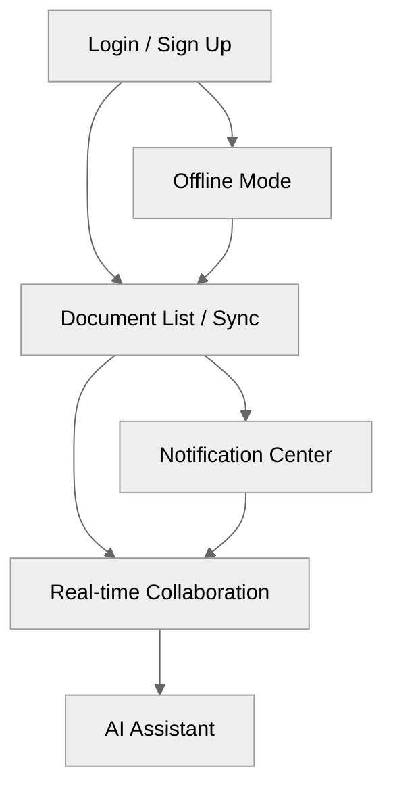
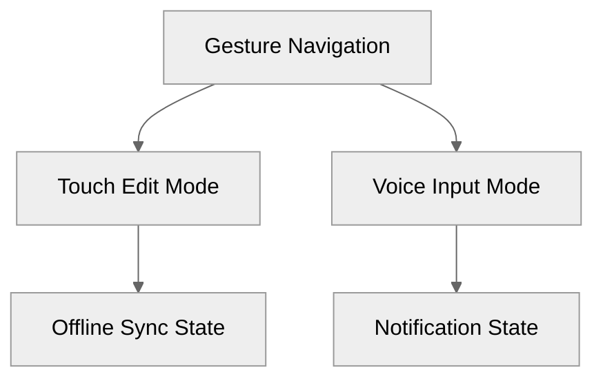
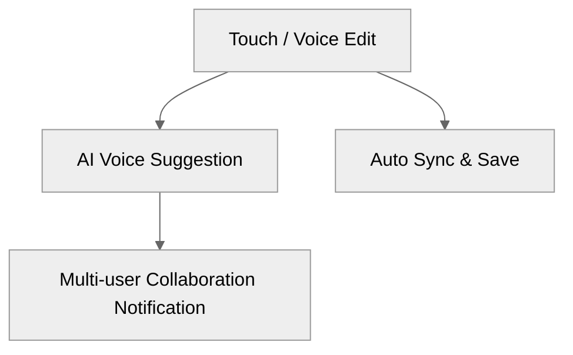

# Mobile App

An enterprise-grade mobile collaboration app with offline-first editing, real-time sync, and integrated AI assistant, built using React Native.

## 🗺️ User Journey Flow (Mermaid)



Mobile-optimized experience: touch-first design, gesture controls, voice input, offline-first strategy.

## 🎨 Mobile Interaction Patterns (Mermaid)



Mobile-first design: gesture support, touch feedback, adaptive layout, dark mode.

## 🎯 Mobile User Action Triggers (Mermaid)



Mobile triggers: voice input, gesture control, location awareness, push notifications

---

## ✨ Tech Stack Highlight

- **Language**: TypeScript, JavaScript (ESNext)
- **Framework**: React Native 0.73, React 18
- **Navigation**: React Navigation 6
- **State Management**: Redux Toolkit, Redux Persist
- **UI**: React Native Elements
- **Animation**: Reanimated 3, Gesture Handler 2
- **Database**: SQLite, AsyncStorage
- **Testing**: Jest, Detox
- **Security**: Encrypted Storage, Keychain, Touch ID

---

## 🚀 Usage

- **Install dependencies:**

  ```sh
  pnpm install
  ```

- **Start Metro bundler:**

  ```sh
  pnpm start
  ```

- **Run on iOS simulator (real API):**

  ```sh
  pnpm ios
  ```

- **Run on Android emulator (real API):**

  ```sh
  pnpm android
  ```

- **Run on iOS simulator (mock data):**

  ```sh
  pnpm ios:mock-data
  ```

- **Run on Android emulator (mock data):**

  ```sh
  pnpm android:mock-data
  ```

- **Run on iOS simulator (mock API):**

  ```sh
  pnpm ios:mock-api
  ```

- **Run on Android emulator (mock API):**

  ```sh
  pnpm android:mock-api
  ```

- **Type check:**

  ```sh
  pnpm type-check
  ```

- **Lint code:**

  ```sh
  pnpm lint
  ```

- **Format code:**

  ```sh
  pnpm format
  ```

- **Run all unit tests:**

  ```sh
  pnpm test
  ```

- **Watch tests:**

  ```sh
  pnpm test:watch
  ```

- **Test coverage report:**

  ```sh
  pnpm test:coverage
  ```

- **Verify (type check, lint, test):**

  ```sh
  pnpm verify
  ```

- **Build and run Detox E2E tests (iOS):**

  ```sh
  pnpm detox:build:ios
  pnpm detox:test:ios
  ```

- **Build and run Detox E2E tests (Android):**

  ```sh
  pnpm detox:build:android
  pnpm detox:test:android
  ```
