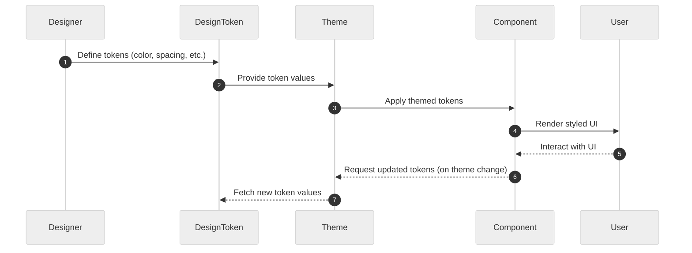
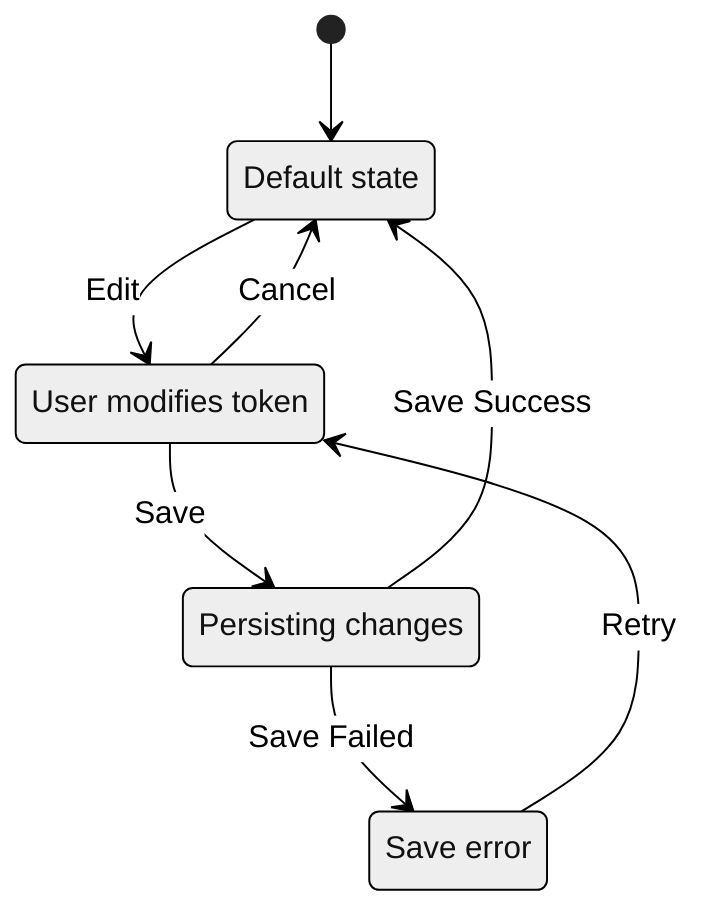

# React Native Design System Skeleton

An extensible design system for React Native, providing reusable UI components and consistent theming for cross-platform mobile apps.

---

## 🧬 Design Token Flow Sequence Diagram



---

## 🔄 State Machine Diagram



---

## ✨ Tech Stack Highlight

- **Language**: JavaScript (ESNext)
- **Framework**: React Native 0.82
- **Component Preview**: Storybook 8
- **Theming**: Custom theme tokens (TypeScript)

---

## 🚀 Usage

- **Install dependencies:**

  ```sh
  pnpm install
  ```

- **Start Storybook (component preview):**

  ```sh
  pnpm storybook
  ```

  Open [http://localhost:6016](http://localhost:6016) in browser.
