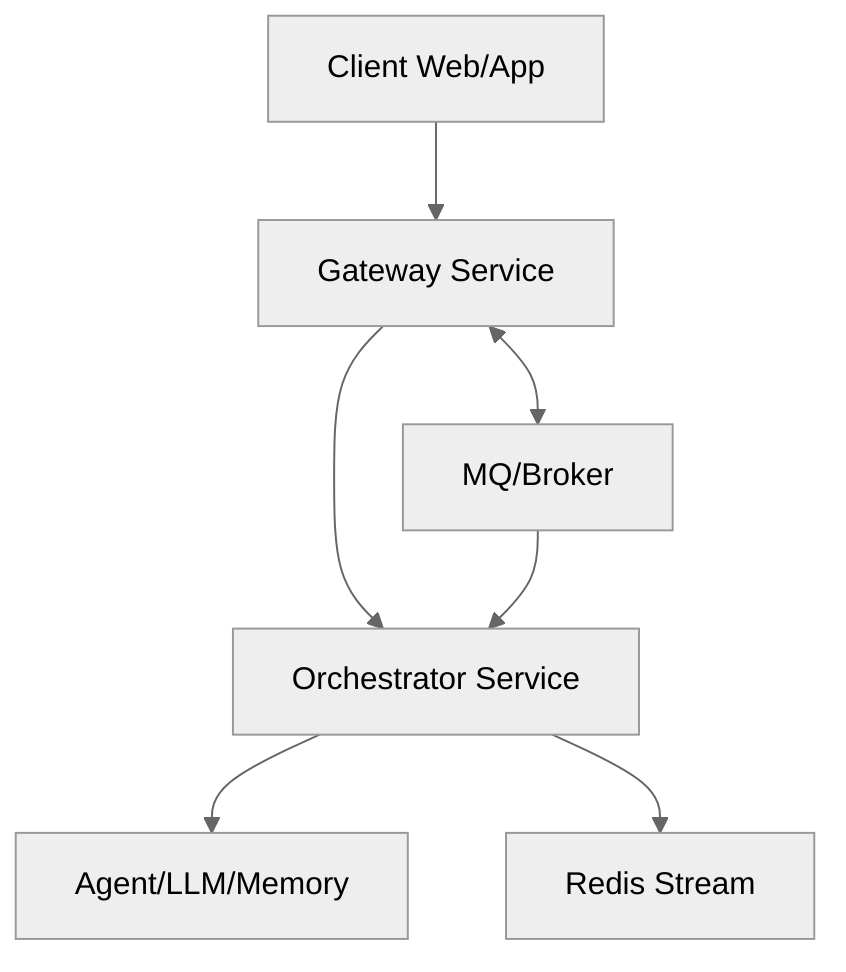
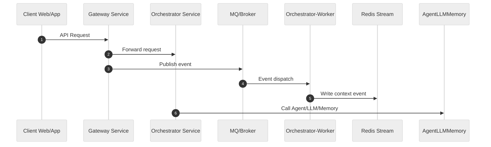

# AI Orchestrator Service

A TypeScript/NestJS microservice for orchestrating multi-model AI workflows, event-driven context flows, and RLHF feedback collection with Langchain, Langfuse, and Redis Stream integration.

## 🗂️ Architecture Diagram



---

## 🔄 Data Flow Sequence Diagram



---

## ✨ Tech Stack Highlight

- **Language**: TypeScript 5.x
- **Framework**: NestJS 11.1.8
- **Key Libraries**: Langchain v0.1+, Langfuse, Prisma 5.x
- **Database**: SQLite (via Prisma ORM)
- **Message Queue**: Redis Stream

---

## 🚀 Usage

- **Install dependencies:**

  ```sh
  pnpm install
  ```

- **Build the project:**

  ```sh
  pnpm run build
  ```

- **Start in development mode (auto-reload):**

  ```sh
  pnpm run start:dev
  ```

- **Run all unit tests:**

  ```sh
  pnpm test
  ```

- **Watch mode for tests:**

  ```sh
  pnpm test:watch
  ```

- **Run smoke tests:**

  ```sh
  pnpm run test:smoke
  ```

- **Coverage report:**

  ```sh
  pnpm test:cov
  ```
