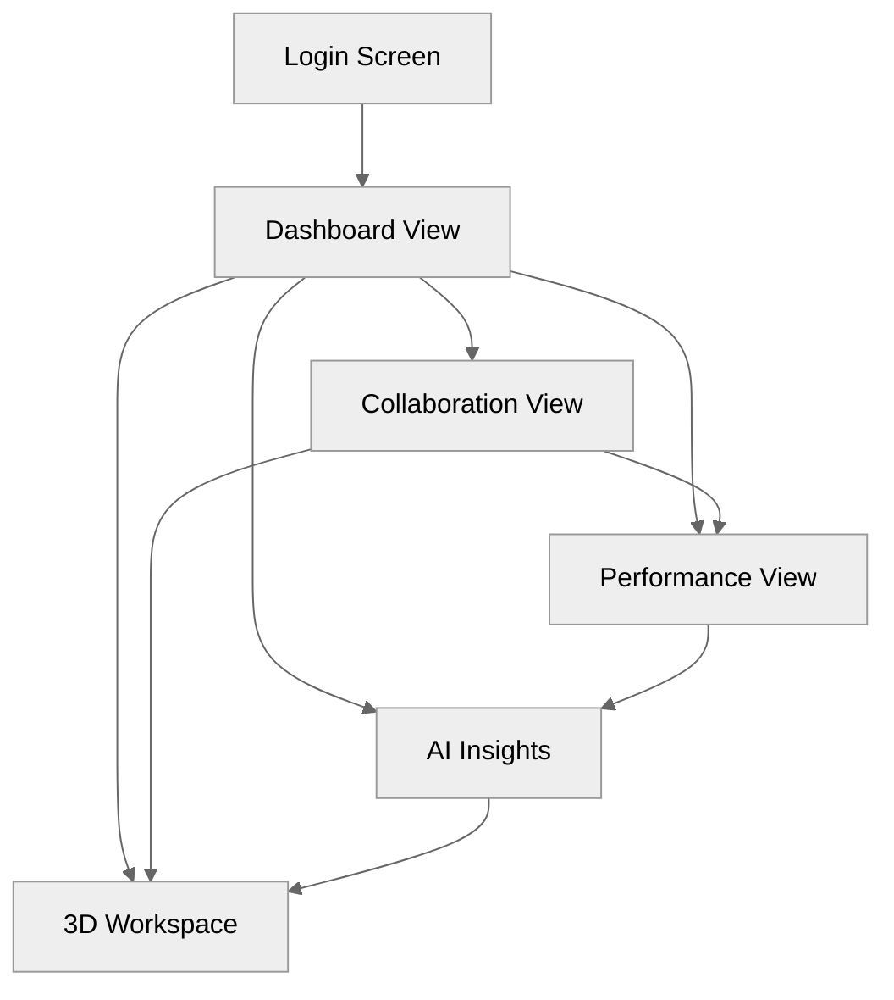
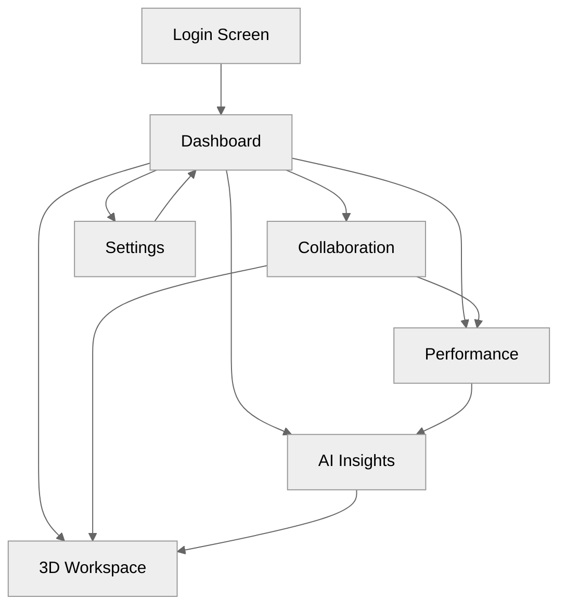
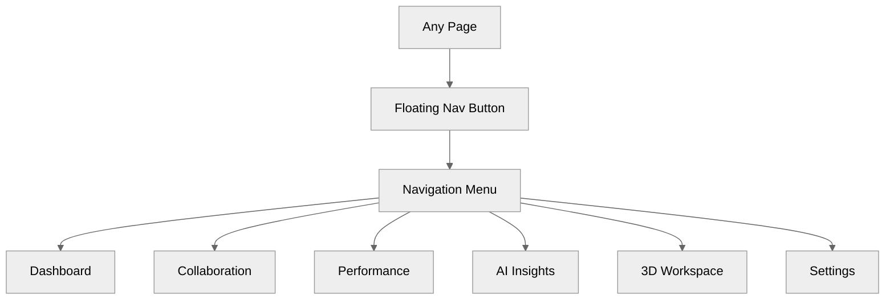

# syncCoreAI-dashboard-frontend

An enterprise-grade Vue 3 analytics dashboard for real-time collaboration, AI insights, and interactive 3D data visualization.

## 🗺️ User Journey Flow (Mermaid)



---

## 🎨 INTERACTIVE USER FLOWS (Mermaid)



---

## 🎭 FLOATING NAVIGATION (Mermaid)



---

## ✨ Tech Stack Highlight

- **Language**: TypeScript 5.x
- **Framework**: Vue 3 + Vite
- **Key Libraries**: D3.js, Three.js, Chart.js, Pinia, Vue Router, Tailwind CSS
- **State Management**: Pinia
- **Styling**: Tailwind CSS

---

## 🚀 Usage

- **Install dependencies:**

  ```sh
  pnpm install
  ```

  - **Build for production:**

  ```sh
  pnpm run build
  ```

- **Build with bundle analyzer:**

  ```sh
  pnpm run build:analyze
  ```

- **Start development server:**

  ```sh
  pnpm run dev
  ```

- **Start with mock API:**

  ```sh
  pnpm run dev:mock-api
  ```

- **Start with mock data only:**

  ```sh
  pnpm run dev:mock-data
  ```

- **Preview production build:**

  ```sh
  pnpm run preview
  ```

- **Run all unit tests:**

  ```sh
  pnpm test
  ```

- **Run E2E tests:**

  ```sh
  pnpm run test:e2e
  ```

- **Coverage report:**

  ```sh
  pnpm run test:coverage
  ```

- **Type check:**

  ```sh
  pnpm run type-check
  ```

- **Lint and fix code:**

  ```sh
  pnpm run lint:fix
  ```

- **Lighthouse performance report:**

  ```sh
  pnpm run lighthouse
  ```

- **Bundle analyzer:**

  ```sh
  pnpm run bundle-analyzer
  ```
