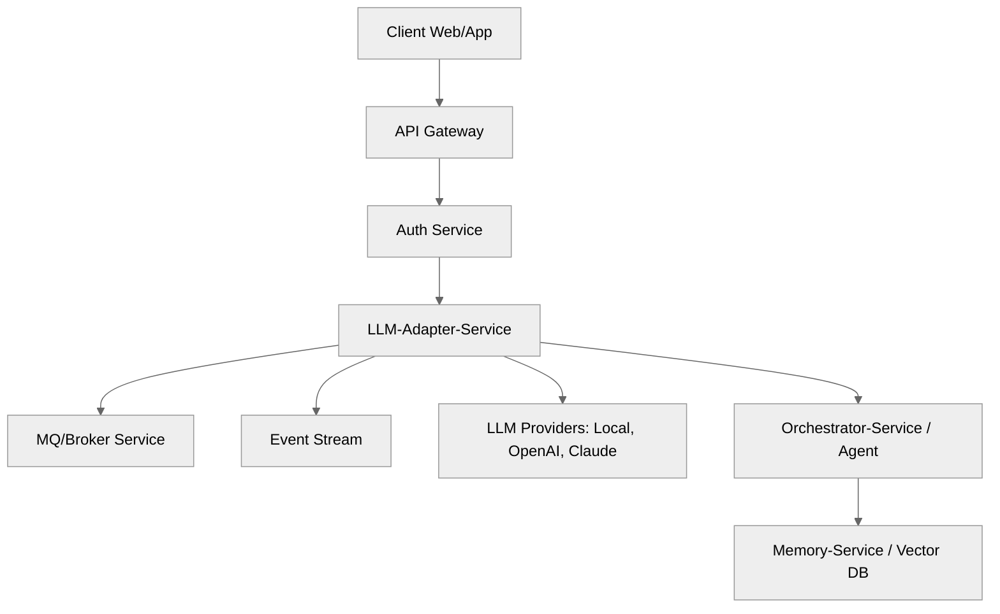
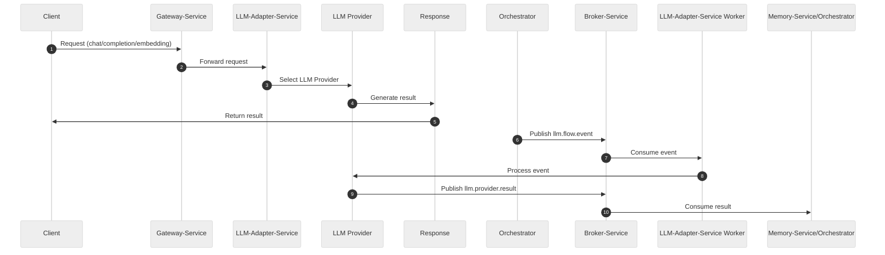

# llm-adapter-service

A modular, multi-provider LLM adapter service for unified AI inference, event-driven flows, and RLHF feedback, built with NestJS and TypeScript.

## 🗂️ Architecture Diagram and



---

## 🔄 Data Flow Sequence Diagram



---

## ✨ Tech Stack Highlight

- **Language**: TypeScript (Node.js)
- **Framework**: NestJS 11.1.8
- **ORM**: Prisma 5.0.0
- **Database**: SQLite (default, via Prisma)
- **Message Queue**: RabbitMQ (EDA/Broker)
- **Testing**: Jest 29.x, ts-jest
- **Package Manager**: pnpm
- **Dev Tools**: Makefile, Prisma Studio

---

## 🚀 Usage

- **Install dependencies:**

  ```sh
  pnpm install
  ```

- **Build the project:**

  ```sh
  pnpm run build
  ```

- **Start in development mode:**

  ```sh
  pnpm run dev
  ```

- **Run all unit tests:**

  ```sh
  pnpm test
  ```

- **Watch mode for tests:**

  ```sh
  pnpm test:watch
  ```

- **Run smoke tests:**

  ```sh
  pnpm run test:smoke
  ```
