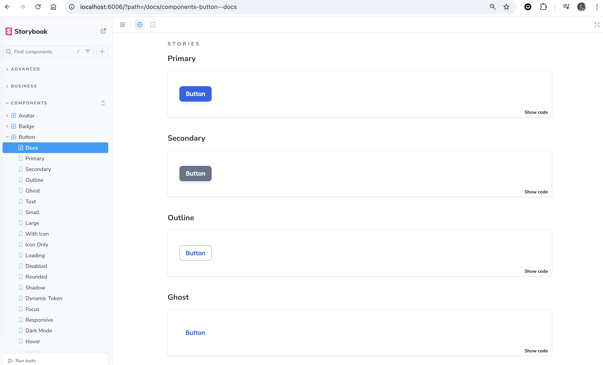
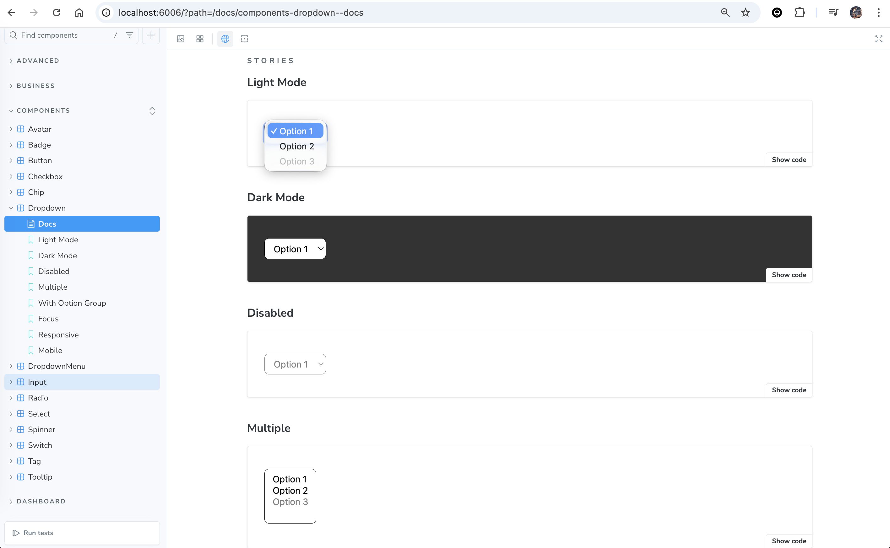
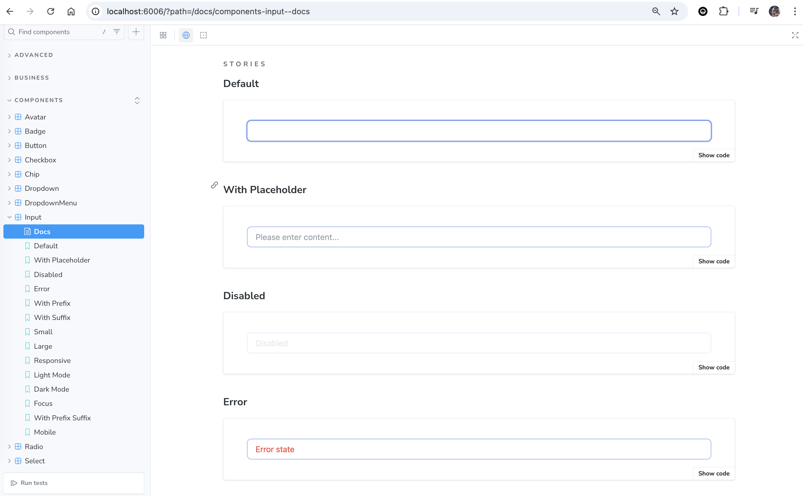

# React.js Tailwind CSS Design System

A modern, scalable React design system powered by Tailwind CSS, Storybook, and TypeScript.

## 🧩 Component Group

### Component

- Button
  
- Dropdown
  
- Input
  

### Layout

### Navigation

### Data Display

### Feedback

### Form

### Overlay

### Advanced

### Dashboard

### Business

---

## ✨ Tech Stack Highlight

- **React** – UI library for building component-based interfaces
- **TypeScript** – Type-safe JavaScript for scalable development
- **Tailwind CSS** – Utility-first CSS framework for rapid UI styling
- **Storybook** – UI component explorer and documentation tool
- **Vite** – Fast build tool and development server
- **Vitest** – Unit testing framework for Vite projects
- **ESLint & Prettier** – Code linting and formatting
- **pnpm** – Fast, disk space efficient package manager

---

## 🚀 Usage

- Install dependencies

  ```sh
  pnpm install
  ```

- Start Storybook (for component development & preview)

  ```sh
  pnpm storybook
  ```

  Open [http://localhost:6006](http://localhost:6006) in browser.

- Build the library

  ```sh
  pnpm build
  ```

  Output will be in the `dist/` folder.

- Test

  ```sh
  pnpm test
  ```

- Type Checking

  ```sh
  pnpm tsc --noEmit
  ```

- Storybook Preview

  ```sh
  pnpm storybook
  ```

- Build Check

  ```sh
  pnpm build
  ```

- Versioning
  - Versioning follows the [SemVer](https://semver.org/) specification.
