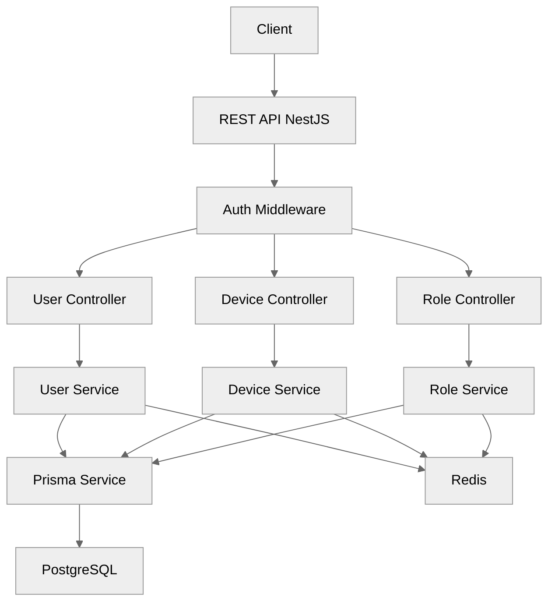
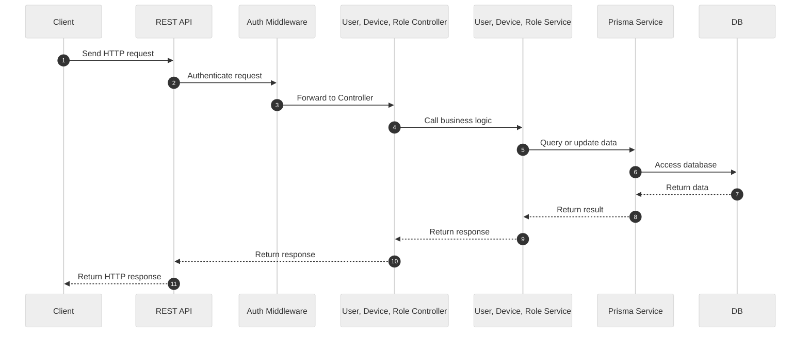

# User Service

User management microservice built with NestJS, TypeScript, and Prisma, supporting multiple database backends and robust testing.

## 🗂️ Architecture Diagram



## 🔄 Data Flow Sequence Diagram



## ✨ Tech Stack Highlight

- **Language**: TypeScript 5
- **Framework**: NestJS 10
- **ORM**: Prisma 5
- **Database**: PostgreSQL, Redis, Mock DB
- **Testing**: Jest

## 🚀 Usage

- **Install dependencies**

  ```sh
  pnpm install
  ```

- **Production:**

  ```sh
  pnpm run start
  ```

- **Development (real DB):**

  ```sh
  pnpm run start:dev
  ```

- **Development (mock DB):**

  ```sh
  pnpm run start:dev-mock
  ```

- **Development (Redis DB):**

  ```sh
  pnpm run start:dev-redis-db
  ```

- **All tests:**

  ```sh
  pnpm run test
  ```

- **Coverage:**

  ```sh
  pnpm run test:cov
  ```

- **Smoke tests:**

  ```sh
  pnpm run test:smoke
  ```

- **User smoke tests:**

  ```sh
  pnpm run test:smoke:user
  ```

- **Role smoke tests:**

  ```sh
  pnpm run test:smoke:role
  ```

- **Device smoke tests:**

  ```sh
  pnpm run test:smoke:device
  ```

- **Init Prisma:**

  ```sh
  pnpm run prisma:init
  ```

- **Generate Prisma client:**

  ```sh
  pnpm run prisma:generate
  ```

- **Migrate DB (dev):**

  ```sh
  pnpm run prisma:migrate:dev
  ```

- **Open Prisma Studio:**

  ```sh
  pnpm run prisma:studio
  ```
