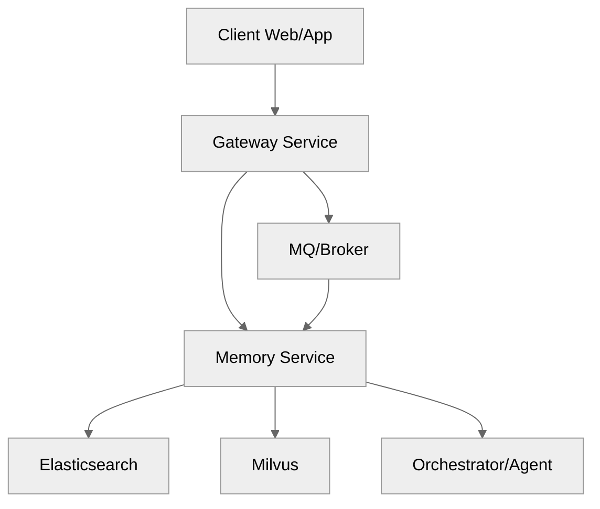
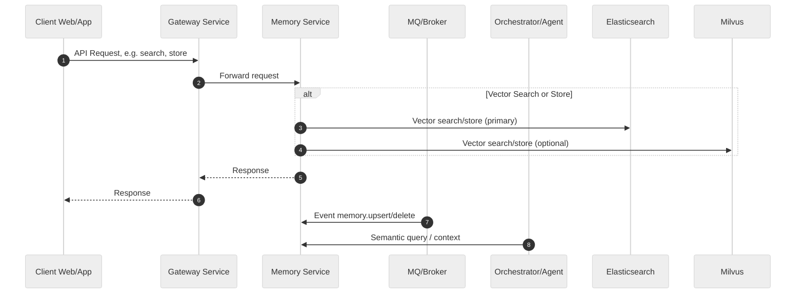

# Vector Memory Service

A scalable, multi-backend vector memory service for semantic search, hybrid retrieval, and event-driven AI workflows, built with NestJS and TypeScript.

## 🗂️ Architecture Diagram



---

## 🔄 Data Flow Sequence Diagram



---

## ✨ Tech Stack Highlight

- **Language:** TypeScript NestJS, Prisma SQLite
- **Framework:** NestJS 11.1.8, Prisma 5.0.0
- **Vector DB:** Elasticsearch 8.11.0, Milvus, pgvector
- **Messaging:** RabbitMQ
- **Caching:** ioredis, cache-manager, Redis
- **Validation:** class-validator, class-transformer
- **Testing:** Jest, smoke tests
- **API:** REST, OpenAPI Swagger
- **Observability/Tracing:** langfuse

---

## 🚀 Usage

- Install dependencies

  ```sh
  pnpm install
  ```

- Build the project

  ```sh
  pnpm build
  ```

- Development mode (with auto-reload):

  ```sh
  pnpm start:dev
  ```

- Unit tests:

  ```sh
  pnpm test
  ```

- Smoke tests:

  ```sh
  pnpm test:smoke
  ```

- Coverage report:

  ```sh
  pnpm test:cov
  ```

- Watch mode:

  ```sh
  pnpm test:watch
  ```

- Initialize Prisma:

  ```sh
  pnpm prisma:init
  ```

- Run migrations:

  ```sh
  pnpm migrate
  ```

- Open Prisma Studio:

  ```sh
  pnpm studio
  ```

- Generate Prisma Client:

  ```sh
  pnpm prisma:generate
  ```

- Reset database:

  ```sh
  pnpm prisma:reset
  ```

---
