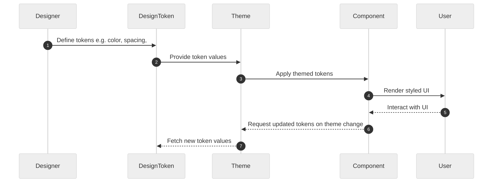
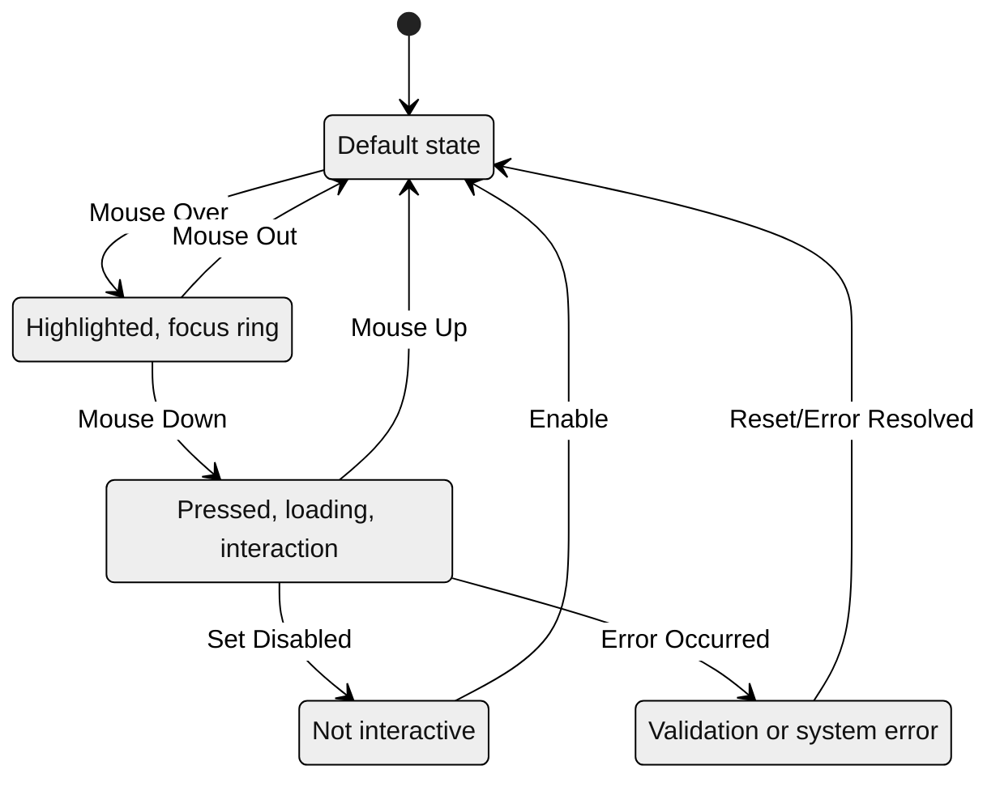

# Vue Tailwind Design System Skeleton

## ⏱️ Design Token Flow Sequence Diagram



---

## 🔄 State Machine Diagram (Mermaid)



---

## ✨ Tech Stack Highlight

- **Language**: TypeScript, JavaScript (ESNext)
- **Framework**: Vue 3.4, Vite 5
- **UI**: Tailwind CSS 3
- **Component Preview**: Storybook 9
- **Testing**: Vitest 1, @vue/test-utils
- **Formatting**: Prettier, ESLint

---

## 🚀 Usage

- **Install dependencies:**

  ```sh
  pnpm install
  ```

- **Start development server:**

  ```sh
  pnpm run dev
  ```

- **Build for production:**

  ```sh
  pnpm run build
  ```

- **Start Storybook:**

  ```sh
  pnpm run storybook
  ```

- **Run all unit tests:**

  ```sh
  pnpm run test
  ```

- **Format code:**

  ```sh
  pnpm run format
  ```

- **Publish to npm:**

  ```sh
  pnpm run publish:lib
  ```
