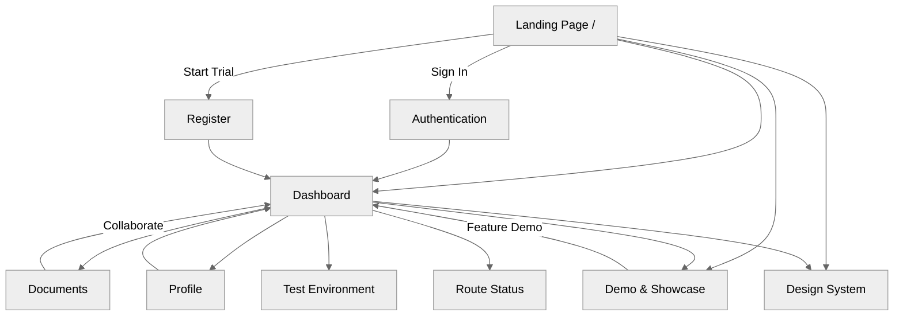
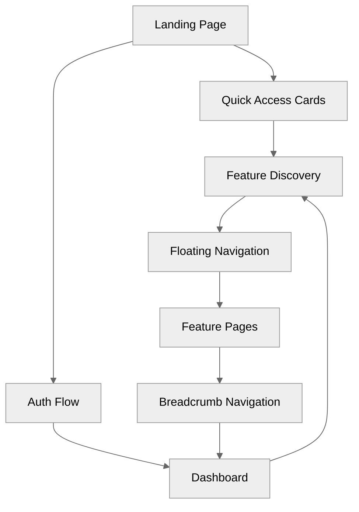
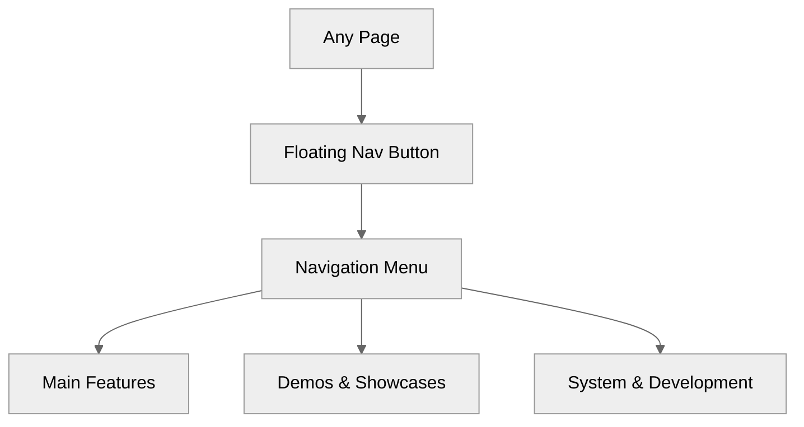

# Web App

A modern Next.js/TypeScript web application for collaborative document editing, real-time AI-powered features, and advanced UI/UX workflows.

## 🗺️ User Journey Flow



---

## 🎯 INTERACTIVE USER FLOWS



---

## 🎭 FLOATING NAVIGATION



---

## ✨ Tech Stack Highlight

- **Language**: TypeScript 5.x
- **Framework**: Next.js 14 (App Router)
- **Key Libraries**: Tailwind CSS, Redux Toolkit, CVA, i18next, Playwright, Jest
- **State Management**: Redux Toolkit
- **Styling**: Tailwind CSS, CSS Modules, Design Tokens

---

## 🚀 Usage

- **Install dependencies:**

  ```sh
  pnpm install
  ```

- **Start development server:**

  ```sh
  pnpm run dev
  ```

- **Start with mock API:**

  ```sh
  pnpm run dev:mock-api
  ```

- **Start with mock data only:**

  ```sh
  pnpm run dev:mock-data
  ```

- **Full development setup with fresh mock data:**

  ```sh
  pnpm run dev:full
  ```

- **Reset and start with fresh data:**

  ```sh
  pnpm run dev:reset
  ```

- **Minimal development mode:**

  ```sh
  pnpm run dev:minimal
  ```

- **Build for production:**

  ```sh
  pnpm run build
  ```

- **Build for static deployment:**

  ```sh
  pnpm run build:static
  ```

- **Start production server:**

  ```sh
  pnpm run start
  ```

- **Run all tests:**

  ```sh
  pnpm test
  ```

- **Watch mode for tests:**

  ```sh
  pnpm test:watch
  ```

- **Coverage report:**

  ```sh
  pnpm test:coverage
  ```

- **Lint and fix code:**

  ```sh
  pnpm run lint:fix
  ```

- **Type check:**

  ```sh
  pnpm run type-check
  ```

- **Format code:**

  ```sh
  pnpm run format
  ```

- **Health check:**

  ```sh
  pnpm run health
  ```

- **Generate documentation:**

  ```sh
  pnpm run docs:generate
  ```
